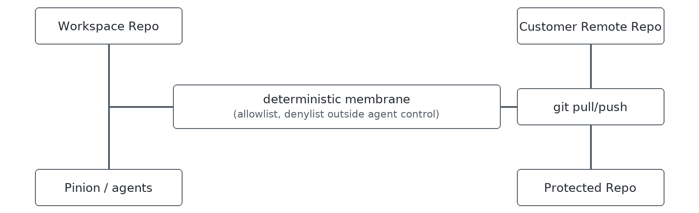

# H-Frame

[](https://pypi.org/project/h-frame/)
[](https://pypi.org/project/h-frame/)

H-Frame is a **repository isolation topology for AI-assisted software delivery**.

H-Frame assumes something many current agentic frameworks still avoid admitting:

> Code agents are smart, useful, increasingly powerful… and fundamentally stochastic.

They:

* leak hidden files
* overgeneralize from bad repo history
* accidentally commit orchestration artifacts
* mutate unrelated paths
* infer unsafe shortcuts
* carry weird priors from earlier work

Most AI coding infrastructure responds by giving agents:

* more permissions
* larger scopes
* broader context
* deeper repository access
* longer-lived workspaces

H-Frame goes the opposite direction.

Instead of trying to create a perfectly obedient agent, H-Frame creates a topology where imperfect agents are better contained.

The core idea is simple:

```text
protected repo ← deterministic membrane → disposable agent workspace
```

Agents work only inside a disposable workspace copy with:

* no git remotes configured (so a normal `git push` to upstream is not available from this tree)
* the `./hframe` bridge exposes no alternate paths, flags, or policy overrides; export scope is defined by host-side files under `.hframe/`, which operators should keep off agent-only writable surfaces

A small workspace launcher (`./hframe` — a `python3` script on POSIX, prebuilt `.exe` on Windows) is the **intended** bridge for `in` / `out` across the membrane.

The result:

* agents can work aggressively in the workspace
* humans retain control of policy and the protected clone
* accidental export breadth is **reduced** compared with many ad hoc setups (still not a substitute for review, CI, or host hardening)
* orchestration-style paths are **filtered** on promotion when allowlists, denylists, and built-in denies are aligned with how you work

H-Frame is licensed under Apache 2.0.

---

## The one-sentence pitch

**H-Frame aims to contain AI agent blast radius by separating workspace clones from canonical repositories, using a minimal `in` / `out` bridge and host-controlled policy that the bridge itself does not expose as configurable flags.**

---

## Why does H-Frame need to exist?

Because the current default pattern for AI coding is roughly:

```text
give the agent the real repo and hope for the best
```

That works surprisingly often.

Until:

* hidden internals leak
* orchestration files get committed
* prompt artifacts appear upstream
* agents cargo-cult bad historical patterns
* giant context windows amplify repository weirdness
* multi-agent workflows start colliding

Most current mitigations are soft:

* `.gitignore`
* AGENTS.md
* prompt instructions
* branch protections
* “please don’t touch this folder”

H-Frame adds **layout, remote removal, and policy-driven sync** so export is easier to reason about than prompt-only rules alone. It is **not** a substitute for code review, CI, execution sandboxing, or good hygiene on the operator machine.

---

# The H-Frame topology



The protected repo:

* keeps the git remote
* remains the source of truth
* is not intended as the agent working tree under normal workflows (use the workspace copy for agent work)

The workspace repo:

* has all remotes removed immediately
* is disposable
* is allowed to become “contaminated”
* contains the local `./hframe` bridge entrypoint (POSIX: portable `python3` launcher; Windows: prebuilt shim)

The membrane:

* uses fixed `in` / `out` steps (`rsync` + `git`) for a given policy file
* is configured on the host under `.hframe/`, outside the agent-visible bridge
* does not widen export scope through extra `./hframe` flags; changing what syncs means editing host-side policy (operator responsibility)
* exposes only `in` and `out` on the bridge

---

# The core idea

H-Frame treats agents more like:

* semi-trusted CI workers

than:

* human developers

Humans are trusted by:

* identity
* accountability
* organizational controls

Agents must instead be trusted by:

* topology
* constrained authority
* deterministic promotion paths

That distinction matters.

---

# What makes H-Frame different?

## H-Frame vs Shadow Repos

Many power users already manually create “shadow repos”:

* copy repo
* remove remote
* work there
* manually sync changes back

H-Frame formalizes this into a deterministic operational pattern.

| Shadow Repo Pattern         | H-Frame                             |
| --------------------------- | ----------------------------------- |
| Ad hoc                      | Structured topology                 |
| Human discipline            | Deterministic membrane              |
| Sync scripts drift          | Compiled sync bridge                |
| Agents may alter ad hoc scripts | Changing export rules via the bridge is not supported; policy files live on the host (still editable by anyone with host access) |
| Runtime arguments           | Fixed `in` / `out` commands only      |
| Easy to bypass accidentally | Harder to widen export **through the bridge alone**; not proof against a compromised host or careless policy placement |
| Usually undocumented        | Explicit operational model          |

H-Frame is not:

> “a better rsync wrapper.”

It is:

> “a repository topology optimized for stochastic code agents.”

---

## H-Frame vs Branch Protection

Branch protection helps protect:

* remotes
* merge rules
* review flow

It does not:

* isolate workspaces
* stop hidden file leakage locally
* prevent repo contamination
* constrain filesystem export scope

H-Frame operates *before* git push.

---

## H-Frame vs Sandboxes

H-Frame is not:

* a VM
* a container runtime
* a syscall sandbox
* a security product

It is:

* a repository isolation membrane

The goal is not:

> “perfectly secure agents.”

The goal is:

> “bounded operational blast radius.”

---

# Release and stability

See `RELEASES.md` for release notes and migration guidance.

## Roadmap

North star: **Portable topology contract (layout + sync semantics + receipts) that agents and CI can assume.** The preview line `v2026.6.0` focuses on local bootstrap and the `in` / `out` membrane; when the contract hardens, expect updates in `RELEASES.md` and the PRD.

Install from PyPI with **`pip install h-frame`** (not `pip install hframe` — that name is a different project).

## Telemetry

**H-Frame does not ship telemetry.** `hframe-bootstrap`, the workspace `./hframe` shim, and the bundled membrane do not send usage analytics or “phone home.” Network use is limited to what **you** invoke (for example `git clone` / `git pull` / `git push` against remotes you configure). If you wrap or redistribute H-Frame, outbound behavior from your wrapper is outside this project’s scope.

---

# What H-Frame does today

* Clones a protected canonical repository
* Creates an isolated workspace copy
* Removes all workspace git remotes immediately
* Creates a local `./hframe` helper inside the workspace
* Documents default agent sync rules in README (optional operator snippet append to `AGENTS.md` when configured)
* Syncs workspace changes through allowlist- and denylist-controlled rsync
* Export scope is not widened through the `./hframe` CLI; changing what syncs means editing host-side policy (operator)
* Uses deterministic `in` / `out` synchronization commands only
* Keeps synchronization policy outside agent-visible workflow surfaces
* Supports disposable “fresh sprint” workspaces

---

# The agent angle

Most AI coding systems are currently expanding:

* context
* permissions
* persistence
* autonomy

H-Frame intentionally reduces:

* authority
* boundary intelligence
* synchronization flexibility
* persistence
* repository reach

The important distinction:

> H-Frame does not constrain creativity inside the workspace.

It only constrains:

> what is allowed to escape.

Agents can:

* refactor aggressively
* generate files
* experiment freely
* commit locally
* iterate rapidly

But promotion toward the canonical remote follows fixed `in` / `out` steps for a given policy file—not arbitrary agent-chosen sync commands.

---

# Fresh workspaces matter

H-Frame encourages:

> every sprint starts fresh.

This is partly **operational hygiene** (throwing away cruft) and partly a **quality tradeoff**: long-lived workspaces can accumulate patterns and files that steer agents in unhelpful directions. H-Frame does not automatically rebuild workspaces; see `RELEASES.md` for current scope.

---

# Install

Requirements:

* Python 3.11+
* git
* rsync
* On **Windows**, a prebuilt `hframe-shim-windows-amd64.exe` under `hframe/native/prebuilt/` in the installed wheel (operators building from source must supply it; see `src/hframe/native/prebuilt/README.md`)

Install from PyPI (operators):

```bash
pip install h-frame
```

From a clone:

```bash
pip install -e .
```

For development:

```bash
pip install -e '.[dev]'
```

This installs:

* `hframe-bootstrap`

Agents do **not** globally install H-Frame.

Agents use:

* `./hframe`

inside the workspace only.

---

# Bootstrap an H-Frame

From a parent directory:

```bash
hframe-bootstrap 'git@github.com:org/repo.git'
```

Exactly one argument is accepted:

* the git URL

Bootstrap creates:

```text
<slug>_repo/
<slug>_workspace_repo/
.hframe/
```

If `<slug>_workspace_repo/.devcontainer/devcontainer.json` is **not** already present (for example the upstream repo did not ship one), bootstrap also writes a minimal `.devcontainer/devcontainer.json` with the bind mounts described under **Devcontainers** so `./hframe` can find the membrane in a container. If that file **already exists**, bootstrap leaves it unchanged—you must merge those `mounts` yourself.

---

# What bootstrap does

## 1. Clone protected repo

```text
<slug>_repo/
```

Keeps:

* `origin`
* push capability
* canonical git state

Operators and tooling should treat this tree as canonical for upstream push; agent editing should happen in the workspace copy, not here.

---

## 2. Create workspace repo

```text
<slug>_workspace_repo/
```

This becomes the agent execution environment.

---

## 3. Remove workspace remotes

Immediately removes:

* upstream push
* upstream fetch

With remotes removed from the workspace clone, a normal `git push` to upstream is not available from that tree. Operators are still responsible for credentials, other local clones, and anything else on the host that could push or copy data out of band.

---

## 4. Optional AGENTS.md append

Bootstrap does **not** write default H-Frame sync rules to workspace `AGENTS.md`; those live under **H-Frame Sync Rules** in this README.

Optionally, bootstrap appends operator-provided agent guidance when `HFRAME_AGENTS_APPEND_FILE` points at a markdown snippet file. Set it in the shell or in `.hframe/bootstrap.env` (relative paths resolve from the **current working directory** where you run `hframe-bootstrap`; shell exports win over the env file).

Bootstrap reads `.hframe/bootstrap.env` from the layout directory, the process working directory, or **the parent of the layout directory** (for example `hframe-scratch-workspaces/.hframe/bootstrap.env` while `create-hframe-parent.sh` runs bootstrap inside `podbay-parent/`). Appended content lands in **`<slug>_workspace_repo/AGENTS.md`**, not the bootstrap parent folder.

```bash
# Optional: append custom agent rules at bootstrap (snippet one level up from the layout dir)
HFRAME_AGENTS_APPEND_FILE='../MYAGENTS.md' hframe-bootstrap 'git@github.com:org/repo.git'

# Or persist in the scratch workspace (works with create-hframe-parent.sh)
echo 'HFRAME_AGENTS_APPEND_FILE=../MYAGENTS.md' >> .hframe/bootstrap.env
./create-hframe-parent.sh 'git@github.com:org/repo.git'
# then: cat podbay_workspace_repo/AGENTS.md
```

If the variable is unset, bootstrap leaves `AGENTS.md` unchanged (only present when copied from upstream or written by your snippet).

---

## 5. Workspace `./hframe` launcher

Bootstrap creates:

```text
<slug>_workspace_repo/hframe
```

On **Linux and macOS**, this is a short **stdlib-only `python3` script** (same behavior as the optional `native/shim.c` reference implementation): it resolves `../.hframe/hframe-membrane.pyz` next to the workspace and `exec`s `python3` on that zipapp. The same file can move between host macOS and Linux devcontainers without an “Exec format error” from mismatched native binaries.

On **Windows**, bootstrap copies a **prebuilt** `hframe-shim-*.exe` from package data.

The launcher:

* lives only in the workspace
* exposes only `in` and `out`
* accepts no arbitrary sync paths
* exposes no policy configuration
* minimizes agent creativity at the trust boundary

---

## 6. Devcontainers

`./hframe` looks for the membrane at **`<bootstrap-parent>/.hframe/hframe-membrane.pyz`**, where `<bootstrap-parent>` is the directory that also contains `<slug>_workspace_repo/` (the same layout `hframe-bootstrap` creates next to `.hframe/`).

Many devcontainers mount **only** the workspace git repository, so `../.hframe/` does not exist inside the container and `./hframe` fails. H-Frame does not try to infer every host layout; you must **bind-mount** the bootstrap parent and/or `.hframe` into the container filesystem the launcher can see.

**Recommended `mounts` (flat `/workspaces/<repo>` workspace):** keep the editor’s default workspace folder (typically `/workspaces/<basename>`) and add **both** binds so resolution hits either the canonical sibling path or the `hframe-root` fallback used by `shim_install`:

```json
"mounts": [
  "source=${localWorkspaceFolder}/..,target=/workspaces/hframe-root,type=bind,consistency=cached",
  "source=${localWorkspaceFolder}/../.hframe,target=/workspaces/.hframe,type=bind,consistency=cached,readonly"
]
```

The first line exposes the full bootstrap parent at `/workspaces/hframe-root/` (protected clone, workspace sibling, `.hframe/`). The second maps **only** `../.hframe` to **`/workspaces/.hframe/`**, which matches the launcher’s first probe when the workspace parent is `/workspaces`.

**After `hframe-bootstrap`:** if `<slug>_workspace_repo/.devcontainer/devcontainer.json` was **missing**, bootstrap writes the snippet above (plus a minimal `image`) into that path. Review, commit, or replace as you like.

**If the workspace already had `.devcontainer/devcontainer.json`:** bootstrap **does not** overwrite or merge it. Add the same two `mounts` entries to your existing file (merge into the top-level `mounts` array), then **rebuild** the dev container so `./hframe` can see the zipapp.

**Ambiguous layouts:** if several directories under `/workspaces` each contain `.hframe/hframe-membrane.pyz` and neither canonical path above applies, resolution can fail or be ambiguous—keep a single visible `.hframe` tree or use the two mounts above.

**Python versions:** the membrane zipapp ships **source** (``.py``) under ``.hframe/``, not minor-locked bytecode, so the same file runs under any ``python3`` that satisfies H-Frame’s ``requires-python`` (for example bootstrap on **3.11** and a devcontainer on **3.12**). Bootstrap still uses ``compileall`` only to **verify** the tree compiles on the operator interpreter before writing the zipapp.

**Host vs Dev Container paths:** the membrane embeds **paths relative to the bootstrap parent** (the directory that contains ``<slug>_repo/``, ``<slug>_workspace_repo/``, and ``.hframe/``). At runtime it re-resolves them from the zipapp location and, if needed, from ``/workspaces/hframe-root`` so the **same** ``hframe-membrane.pyz`` built on the host (for example macOS) still finds the repos after you open the workspace in a Linux dev container with the mounts above. **Regenerate** ``.hframe/hframe-membrane.pyz`` once after upgrading to a build that includes this behavior (re-run ``hframe-bootstrap`` on a fresh parent, or rebuild the zipapp from an installed ``hframe`` if you have a custom pipeline). Older zipapps that embed only absolute paths keep working on the machine where they were built.

**Upgrading the workspace ``./hframe`` script in a devcontainer:** the one-liner that calls ``install_workspace_shim`` imports the **``hframe``** Python package. Install it in the same container (agents do not use a global install for sync, but **operators** need it here to rewrite ``./hframe``):

```bash
pip install h-frame
python3 -c "from pathlib import Path; from hframe.shim_install import install_workspace_shim; install_workspace_shim(Path('hframe').resolve())"
```

Or use ``pip install -e /path/to/h-frame`` from a clone. You can add ``pip install h-frame`` to ``postCreateCommand`` next to ``go mod download`` if you want this to happen automatically.

**Verify the membrane exists in the container** (after fixing mounts):

```bash
ls -la /workspaces/.hframe/hframe-membrane.pyz /workspaces/hframe-root/.hframe/hframe-membrane.pyz
```

At least one of those paths must be a real file before ``./hframe out`` can run.

**Git “dubious ownership” in Dev Containers:** bind-mounted repos often look unsafe to Git. H-Frame runs ``git`` with ``-c safe.directory=<resolved-repo>`` for each repository it touches, so ``./hframe in`` / ``out`` do not require a global ``git config``. That logic lives **inside** ``hframe-membrane.pyz``—**regenerate** the zipapp after upgrading the ``hframe`` package so the bundle picks up the change. Your own shell ``git`` commands may still need ``safe.directory``; the bootstrap-generated devcontainer adds ``safe.directory '*'`` in ``postCreateCommand``, or merge that one-liner into an existing ``postCreateCommand`` with ``&&``.

# Sync commands

Inside the workspace:

```bash
./hframe in
```

Refresh workspace from canonical repo.

**Policy tamper resistance:** `.hframe/` lives on the bootstrap parent, not in the workspace git tree. Bootstrap sets policy files to **read-only** (`0444` on POSIX). Generated devcontainers mount `../.hframe` **read-only** so agents cannot rewrite allow/deny lists inside the container. Edit policy on the **host** (or temporarily drop the readonly mount)—not via agent prompts. **Git dubious ownership** in containers is handled by the membrane (`safe.directory` per repo); do not widen the allowlist or switch to denylist-only to “fix” git errors.

**Vault mode (optional):** `pip install 'h-frame[vault]'` then `hframe-bootstrap --vault <git-url>` encrypts `policy.allowlist` / `policy.denylist` on disk and compiles a **one-time vault password** into `hframe-membrane.pyz`. `./hframe in|out` uses that compiled password automatically (agents do not need env). Operators edit policy with `./hframe-vault` and `HFRAME_VAULT_PASS` (see below).

#### Manual vault policy edit (decrypt and re-seal)

**Bootstrap** (`hframe-bootstrap --vault`) generates a random vault password, encrypts policy files, embeds the password in `hframe-membrane.pyz`, and installs `./hframe-vault` on the bootstrap parent.

To print the password once at bootstrap (save it for later):

```bash
HFRAME_BOOTSTRAP_DEBUG=1 hframe-bootstrap --vault '<git-url>'
# prints: export HFRAME_VAULT_PASS='…' for ./hframe-vault
```

**During the workspace lifetime**, decrypt/edit/re-encrypt on the **host** (not inside a read-only Dev Container `.hframe` mount):

```bash
cd /path/to/bootstrap-parent
source .venv/bin/activate
export HFRAME_VAULT_PASS='…'    # url-safe base64 password from bootstrap debug output

./hframe-vault decrypt allowlist
# edit .hframe/policy.allowlist.edit
./hframe-vault encrypt allowlist

./hframe-vault decrypt denylist
# edit .hframe/policy.denylist.edit
./hframe-vault encrypt denylist
```

`encrypt` checks that `HFRAME_VAULT_PASS` matches the password compiled into `hframe-membrane.pyz`, then re-seals the vault file. **`./hframe in|out` does not use `HFRAME_VAULT_PASS`**—it reads the compiled password from the zipapp.

You do not need to rebuild `hframe-membrane.pyz` after re-seal (same compiled password).

Install: `pip install -e '/path/to/h-frame[vault]'`. Policy line syntax: [PRD.md](PRD.md).

**Policy + `rsync --delete`:** behavior is defined by `../.hframe/policy.allowlist` (or vault blobs when `--vault` was used; see [PRD.md](PRD.md) policy model). **`hframe-bootstrap`** seeds **allowlist** mode by default: **one pattern per repo-root path** that Git does not ignore (via `git check-ignore`), directories as `name/**` and files by basename. **`.hframe/policy.denylist`** is still filled from the protected clone’s root **`.gitignore`** (minus `!` lines) and is merged **after** built-in denies, so ignored subtrees stay out of the sync surface. **`.git/`** and the repo-root **`./hframe`** launcher are never mirrored. If no root paths qualify (edge case), bootstrap writes **denylist-only** instead. For a full-tree sync except denies, replace `policy.allowlist` with the denylist-only directive (README).

The membrane zipapp path is fixed relative to the workspace (see **Devcontainers** above).

---

```bash
./hframe out
```

Export policy-permitted changes back upstream (path-limited `git add` in allowlist mode, or `git add -A` in denylist-only mode).

---

# Design principle

The boundary should be:

* deterministic
* minimal
* boring
* externally controlled

Not:

* prompt-driven
* dynamically configurable
* agent-negotiated

The membrane intentionally behaves more like:

* an appliance

than:

* a scripting framework

---

# Typical workflow

## Operator

```bash
hframe-bootstrap 'git@github.com:org/repo.git'
```

---

## Agent

Work only inside:

```text
<slug>_workspace_repo/
```

---

## A Suggested `AGENTS.md` Ruleset:

```markdown
## H-Frame Sync Rules

- Use `./hframe in` instead of `git pull`.
- Use `./hframe out` instead of `git push`.
- Do not attempt to modify Git remote synchronization behavior.
- Do not create alternative Git remote synchronization mechanisms.
```

A goal of this ruleset is to help ensure that agents will NOT be able to easily do things like:
1. Edit `../.hframe/`, `policy.allowlist`, or `policy.denylist` on the host.
1. Switch to denylist-only or widen the allowlist to work around sync or git errors.

The less awareness an agent has about H-Frame internals, mechanisms, and policy files, likely the safer.

Also notable: Git dubious-ownership in setups like devcontainers will be handled by the H-Frame membrane; we want agents to change workspace state, not sync policy.

---

## Operator

Resolve conflicts normally in:

```text
<slug>_repo/
```

using standard git workflows.

---

# When to use H-Frame

Use H-Frame when:

* agents risk leaking hidden internals into commits
* multiple agents touch the same repo
* you want bounded repository blast radius
* you want disposable workspaces
* you care about operational recoverability
* you want deterministic promotion boundaries
* you are operationalizing AI-assisted coding

---

# When not to use H-Frame

Do not use H-Frame when:

* your workflows are entirely human-driven
* you only occasionally use coding assistants
* you want unrestricted direct repo mutation
* you are looking for a VM/container sandbox
* you need cryptographic provenance systems

H-Frame intentionally stays narrow.

---

# Current non-goals

H-Frame is deliberately not:

* a sandbox runtime
* a security platform
* a secrets manager
* a git replacement
* a cryptographic provenance system
* a policy engine framework
* a generalized orchestration layer

The philosophy is laser-focused:

> repository topology matters in the age of AI-assisted software generation.

# Development

Run tests:

```bash
pytest
```

Integration tests require:

* git
* rsync

---

# Disclaimer

H-Frame is provided **as-is**, without warranties or guarantees of any kind.

H-Frame:

* clones repositories
* synchronizes filesystem state
* stages and pushes git changes
* executes deterministic synchronization operations

You are responsible for:

* reviewing synchronization policy
* validating exported changes
* securing hosts and repositories
* testing workflows before production use

H-Frame is not a guarantee against:

* malicious code
* unsafe repositories
* operator mistakes
* data loss
* service interruption

Use at your own risk.

---

# License

Apache License 2.0.

---

## Maintained by Level Up Labs

H-Frame is an open-source project by [Level Up Labs](https://levelupla.io).

We are building solutions for enterprise-grade AI systems and agent-native software delivery.
